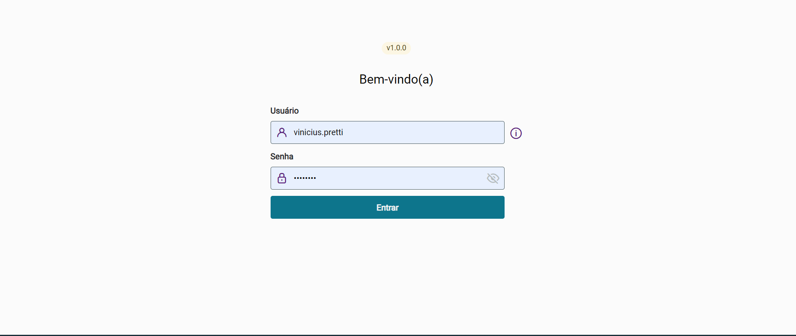
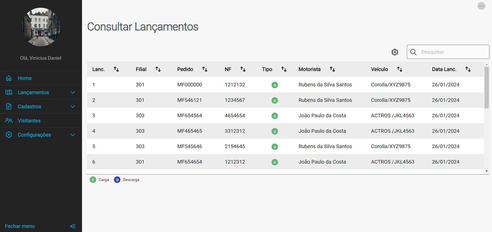
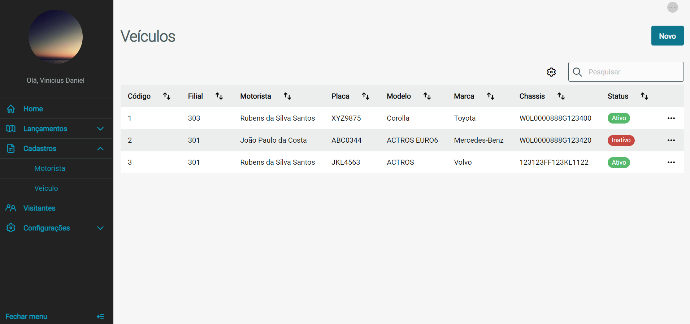

# Projeto Portaria

- O projeto foi contruido com o intuito de controle de caminhões e visitas na empresa.

 

 

### ✌️ Para usar o projeto Front-End

- Usado node.js versão 16.15.1

* Abra a basta "portaria" no cmd, no terminal digite: 

~~~npm
npm i
~~~

~~~npm
npm start
~~~

### ✌️ Para usar o projeto Back-End

* Certifique-se que o Apache Maven esteja instalado na maquina.
* Certifique-se que o Lombok esteja instalado na maquina.
* Certifique-se que o MySql esteja instalado na maquina.
* Faça um "CREATE DATABASE portaria_api" no banco e ajuste as credenciais de login e senha conforme no projeto ou ajuste no projeto no arquivo "application.properties".
* Escolhe "Existing Maven Projects" sob a categoria Maven na IDE Eclipse ou de sua preferencia.

### 📌 Funcionalidades concluídas

- [x] Login e Logout de Usuário
- [x] Autenticação com Token
- [x] Cadastro, Listagem, Edição e Exclusão de Visitantes 
- [x] Cadastro, Listagem, Edição e Exclusão de Motorista 
- [x] Cadastro, Listagem, Edição e Exclusão de Veiculo 
- [x] Cadastro, Listagem, Edição e Exclusão de Usuario 
- [x] Cadastro, Listagem, Edição e Exclusão de Permissão 
- [x] Cadastro, Listagem, Edição e Exclusão de Perfil 
- [x] Cadastro e Listagem de Lançamentos 
- [x] Listagem de Visitas no dia atual e nos próximos 5 dias 
- [x] Validação dos campos dos formulários
- [x] Ajustar para quando o token vencer ele gerar um novo

### 📌 Funcionalidades a fazer

- [ ] Criar Edição e Exclusão dos Lançamentos
- [ ] Criar fluxo de andamento do caminhão (Status de "Aguardando Entrada", "Carregando" e "Concluído")
- [ ] Níveis de acesso para visualização de menus

### ⌨️ Tecnologias e Ferramentas

As seguintes ferramentas foram usadas na construção do projeto:

*Front-end*
* Angular 16
* Biblioteca Po-Ui
* Autenticação Jwt
* Formulários reativos
* Interceptors
* Responsividade

*Back-end*
* Java 17 (Spring boot)
* Maven
* Hibernate e JPA
* Swagger
* Flyway
* MySql
* Autenticação Jwt
